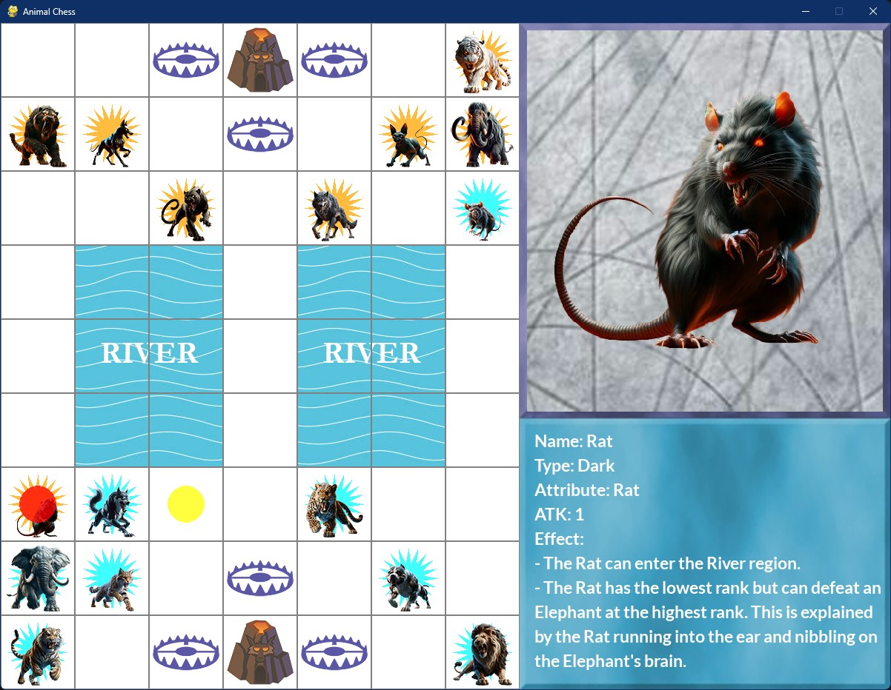

# ANIMAL CHESS
Animal Chess is a two-player strategy game where players use animal pieces with unique abilities to capture opponents or enter their den, requiring tactical placement and special moves, and the game project collects player data to train AI models.

## LINK DEMO
<div align='center'>

[Click here to play the game](https://tynab.github.io/Animal-Chess)

</div>

## IMAGE DEMO
<p align='center'>
</img>
</p>

## CODE DEMO
```python
# Build the model architecture
def build_model(input_shape, activation='relu'):
    # Create a sequential model
    model = Sequential([
        # Input layer specifies the shape of the input data
        Input(shape=input_shape),
        # First convolution layer with 128 filters
        Conv2D(128, (3, 3), padding='same'),
        BatchNormalization(),
        Activation(activation),
        MaxPooling2D((2, 2)),
        # Second convolution layer with 256 filters
        Conv2D(256, (3, 3), padding='same'),
        BatchNormalization(),
        Activation(activation),
        MaxPooling2D((2, 2)),
        # Flatten the output from 2D to 1D before passing to the dense layer
        Flatten(),
        Dense(2048, activation='relu', kernel_regularizer=l2(0.01)),
        Dropout(0.5),
        # Output layer with linear activation to predict a continuous value
        Dense(1, activation='linear')
    ])
    # Compile the model with Adam optimizer and mean squared error loss
    model.compile(optimizer=Adam(learning_rate=0.0001), loss='mean_squared_error', metrics=['mae'])
    # Return the model
    return model
```
